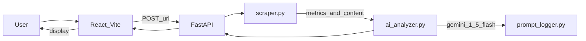

# Action Plan

Build a lightweight AI-powered Website Audit Tool per [REQUIREMENTS.md](REQUIREMENTS.md): accept a single URL, extract factual metrics, generate AI insights and recommendations, and deliver a deployed web app with prompt logs.

**Tech stack:** React + Vite (plain JavaScript) · Python + FastAPI · BeautifulSoup4 + requests · Google Gemini (`gemini-1.5-flash`) via `google-generativeai` · Frontend on Vercel · Backend on Render



---

## Project Structure

```text
ai-native-website-audit/
├── .gitignore
├── README.md
├── REQUIREMENTS.md
├── ACTION_PLAN.md
├── backend/
│   ├── requirements.txt
│   ├── .env.example
│   ├── main.py                 # FastAPI app, CORS, router mount
│   ├── models.py               # Pydantic request/response schemas
│   ├── scraper.py              # Fetch + parse single page
│   ├── ai_analyzer.py          # Gemini prompts, call, parse
│   ├── prompt_logger.py        # Write reasoning traces to disk
│   ├── routes/
│   │   └── audit.py            # POST /api/audit, GET /health
│   └── prompt_logs/            # Runtime logs (gitignored)
│       └── .gitkeep
├── frontend/
│   ├── package.json
│   ├── vite.config.js
│   ├── index.html
│   ├── .env.example
│   ├── vercel.json             # SPA rewrites if needed
│   └── src/
│       ├── main.jsx
│       ├── App.jsx
│       ├── api/
│       │   └── auditApi.js
│       ├── components/
│       │   ├── UrlForm.jsx
│       │   ├── MetricsPanel.jsx
│       │   ├── InsightsPanel.jsx
│       │   ├── RecommendationsPanel.jsx
│       │   ├── ErrorBanner.jsx
│       │   └── LoadingState.jsx
│       └── styles/
│           └── App.css
└── prompt_logs/
    └── sample-audit-log.json   # Committed example for deliverable
```

---

## Phase 1 — Project Setup

- [ ] Confirm git repo is initialized (`git status` runs without error)
- [ ] Create root [`.gitignore`](.gitignore) ignoring: `__pycache__/`, `*.pyc`, `.env`, `venv/`, `node_modules/`, `dist/`, `backend/prompt_logs/*.json` (keep `backend/prompt_logs/.gitkeep` and `prompt_logs/sample-audit-log.json`)
- [ ] Create folder tree: `backend/`, `backend/routes/`, `backend/prompt_logs/`, `frontend/src/api/`, `frontend/src/components/`, `frontend/src/styles/`, `prompt_logs/`
- [ ] Add `backend/prompt_logs/.gitkeep` and `prompt_logs/.gitkeep` (if needed)
- [ ] Create Python virtual environment from project root:
  ```bash
  cd backend
  python -m venv venv
  ```
- [ ] Activate venv (Windows PowerShell): `.\venv\Scripts\Activate.ps1`
- [ ] Install backend dependencies:
  ```bash
  pip install fastapi uvicorn requests beautifulsoup4 google-generativeai pydantic python-dotenv
  pip freeze > requirements.txt
  ```
- [ ] Create [`backend/.env.example`](backend/.env.example):
  ```
  GEMINI_API_KEY=your_key_here
  CORS_ORIGINS=http://localhost:5173
  ```
- [ ] Copy to local env: `cp .env.example .env` and add real Gemini API key
- [ ] Scaffold frontend with Vite (plain JavaScript, no TypeScript):
  ```bash
  cd ..
  npm create vite@latest frontend -- --template react
  cd frontend
  npm install
  ```
- [ ] Create [`frontend/.env.example`](frontend/.env.example):
  ```
  VITE_API_URL=http://localhost:8000
  ```
- [ ] Copy to local env: `cp .env.example .env`
- [ ] Smoke-test backend starts: `cd backend && uvicorn main:app --reload --port 8000`
- [ ] Smoke-test frontend starts: `cd frontend && npm run dev` (default `http://localhost:5173`)

---

## Phase 2 — Backend: Scraper

Implements [REQUIREMENTS.md — Factual Metrics](REQUIREMENTS.md#1-factual-metrics). Single-page only ([Out of Scope](REQUIREMENTS.md#out-of-scope): no multi-page crawling).

Create [`backend/scraper.py`](backend/scraper.py) with a public function `scrape_page(url: str) -> dict`.

- [ ] Implement `fetch_html(url)` using `requests.get`:
  - 10-second timeout
  - User-Agent header (e.g. `WebsiteAuditBot/1.0`)
  - Raise a clear exception on non-2xx status codes, timeouts, or connection errors
- [ ] Parse HTML with BeautifulSoup4 using `html.parser`
- [ ] Extract **total word count** (REQUIREMENTS.md):
  - Remove `script`, `style`, `noscript` tags before counting
  - Count words in visible body text (split on whitespace)
- [ ] Extract **heading counts H1–H3** (REQUIREMENTS.md): count all `h1`, `h2`, `h3` elements separately
- [ ] Extract **number of CTAs** (REQUIREMENTS.md):
  - Count `<button>` elements
  - Count `<input type="submit">` and `<input type="button">`
  - Count `<a>` tags whose text or class/id suggests a primary action (e.g. contains "btn", "cta", or text like "get started", "contact", "sign up", "learn more", "buy", "download")
- [ ] Extract **internal vs external links** (REQUIREMENTS.md):
  - Iterate all `<a href="...">`
  - Skip empty, `#`, `mailto:`, `tel:`, and `javascript:` hrefs
  - Compare link host to page URL host → internal or external
- [ ] Extract **number of images** (REQUIREMENTS.md): count all `` tags
- [ ] Extract **% of images missing alt text** (REQUIREMENTS.md):
  - Missing = no `alt` attribute or whitespace-only `alt`
  - Return float 0–100: `(missing / total) * 100`, or `0.0` if no images
- [ ] Extract **meta title** from `<title>` tag (REQUIREMENTS.md)
- [ ] Extract **meta description** from `<meta name="description" content="...">` (REQUIREMENTS.md)
- [ ] Build `page_text_excerpt`: first ~3000 characters of cleaned body text for AI context
- [ ] Return structured dict matching this shape:

```python
{
  "url": "https://example.com",
  "metrics": {
    "word_count": 0,
    "headings": {"h1": 0, "h2": 0, "h3": 0},
    "cta_count": 0,
    "internal_links": 0,
    "external_links": 0,
    "image_count": 0,
    "images_missing_alt_pct": 0.0,
    "meta_title": "",
    "meta_description": ""
  },
  "page_text_excerpt": "..."
}
```

- [ ] Add `if __name__ == "__main__"` block to print results for manual testing
- [ ] Manually test against `https://example.com` and one real marketing site; verify all 7 metric groups populate

---

## Phase 3 — Backend: AI Module

Implements [REQUIREMENTS.md — AI Insights](REQUIREMENTS.md#2-ai-insights), [Recommendations](REQUIREMENTS.md#3-recommendations), and [Prompt Logs deliverable](REQUIREMENTS.md#deliverables-checklist).

Create [`backend/models.py`](backend/models.py), [`backend/ai_analyzer.py`](backend/ai_analyzer.py), and [`backend/prompt_logger.py`](backend/prompt_logger.py).

### Pydantic schemas

- [ ] Define `InsightSection` with fields: `summary` (str), `details` (str)
- [ ] Define `Recommendation` with fields: `priority` (int 1–5), `title` (str), `reasoning` (str)
- [ ] Define `AIAnalysis` with exactly 5 insight categories from REQUIREMENTS.md:
  - `seo_structure` — SEO structure
  - `messaging_clarity` — Messaging clarity
  - `cta_usage` — CTA usage
  - `content_depth` — Content depth
  - `ux_concerns` — Obvious UX or structural concerns
- [ ] Add `recommendations: list[Recommendation]` (min 3, max 5 per REQUIREMENTS.md)

### Prompt design

- [ ] Write **system prompt** in `ai_analyzer.py` that:
  - Sets role as a web agency auditor (EIGHT25MEDIA context from assignment)
  - Requires insights to be grounded in provided metrics (REQUIREMENTS.md)
  - Requires specific, non-generic analysis that references factual numbers (REQUIREMENTS.md)
  - Instructs JSON-only output matching the `AIAnalysis` schema
- [ ] Write **user prompt template** that injects:
  - Page URL
  - Full metrics JSON from scraper
  - `page_text_excerpt`
  - Explicit instruction to produce 3–5 prioritized recommendations with reasoning tied to metrics

### Gemini API integration

- [ ] Load `GEMINI_API_KEY` from environment via `python-dotenv`
- [ ] Configure `google.generativeai` and instantiate `gemini-1.5-flash` model
- [ ] Call model with system + user prompts; use `generation_config={"response_mime_type": "application/json"}` for structured output
- [ ] Parse JSON response and validate with Pydantic `AIAnalysis` model
- [ ] Retry once on JSON parse or validation failure with a stricter follow-up prompt
- [ ] Expose public function `analyze_page(scrape_result: dict) -> AIAnalysis`

### Prompt logging (REQUIREMENTS.md deliverable)

- [ ] Implement `log_prompt_trace()` in [`backend/prompt_logger.py`](backend/prompt_logger.py) that writes a timestamped JSON file to `backend/prompt_logs/` containing:
  - [ ] The system prompt(s) used
  - [ ] The user prompt(s) as constructed
  - [ ] The structured inputs sent to the model (metrics dict + excerpt)
  - [ ] The raw model output before formatting
- [ ] Redact API keys and sensitive values before writing
- [ ] After a successful test audit, copy one sanitized log to [`prompt_logs/sample-audit-log.json`](prompt_logs/sample-audit-log.json) for submission

---

## Phase 4 — Backend: API

Implements [REQUIREMENTS.md — Interface Requirements](REQUIREMENTS.md#interface-requirements) (local web app + API endpoint with structured output). Supports evaluation criteria: clean separation of scraping and AI, structured outputs, engineering clarity.

Create [`backend/main.py`](backend/main.py) and [`backend/routes/audit.py`](backend/routes/audit.py).

- [ ] Create FastAPI app in `main.py`; load `.env` on startup
- [ ] Configure CORS middleware using `CORS_ORIGINS` env var (comma-separated); default `http://localhost:5173`
- [ ] Mount audit router from `routes/audit.py`
- [ ] Implement `GET /health` returning `{ "status": "ok" }`
- [ ] Define request model `AuditRequest` with `url: HttpUrl` field
- [ ] Implement `POST /api/audit`:
  - [ ] Accept JSON body `{ "url": "https://..." }`
  - [ ] Validate URL is present and uses `http` or `https`
  - [ ] Call `scrape_page(url)` then `analyze_page(scrape_result)`
  - [ ] Return combined JSON with **clear separation** (REQUIREMENTS.md):
    ```json
    {
      "url": "...",
      "audited_at": "2026-06-23T12:00:00Z",
      "metrics": { },
      "insights": {
        "seo_structure": { "summary": "...", "details": "..." },
        "messaging_clarity": { "summary": "...", "details": "..." },
        "cta_usage": { "summary": "...", "details": "..." },
        "content_depth": { "summary": "...", "details": "..." },
        "ux_concerns": { "summary": "...", "details": "..." }
      },
      "recommendations": [
        { "priority": 1, "title": "...", "reasoning": "..." }
      ]
    }
    ```
- [ ] Error handling with consistent `{ "detail": "..." }` responses:
  - [ ] `400` — invalid or missing URL
  - [ ] `422` — page fetch failed (timeout, DNS, non-2xx)
  - [ ] `502` — Gemini API failure or unparseable AI response after retry
- [ ] Test via Swagger UI at `http://localhost:8000/docs`
- [ ] Test via curl:
  ```bash
  curl -X POST http://localhost:8000/api/audit \
    -H "Content-Type: application/json" \
    -d '{"url": "https://example.com"}'
  ```

---

## Phase 5 — Frontend

Implements [REQUIREMENTS.md — Interface Requirements](REQUIREMENTS.md#interface-requirements) (local/deployed web app) and mandatory separation of factual metrics from AI insights.

- [ ] Create [`frontend/src/api/auditApi.js`](frontend/src/api/auditApi.js):
  - [ ] Export `auditUrl(url)` function
  - [ ] `POST` to `${import.meta.env.VITE_API_URL}/api/audit` with `{ url }`
  - [ ] Parse JSON response; throw with `detail` message on non-2xx
- [ ] Create [`frontend/src/components/UrlForm.jsx`](frontend/src/components/UrlForm.jsx):
  - [ ] Text input for URL and submit button
  - [ ] Client-side validation (non-empty, starts with `http://` or `https://`)
  - [ ] Disable form while audit is in progress
  - [ ] Call `onSubmit(url)` prop
- [ ] Create [`frontend/src/components/MetricsPanel.jsx`](frontend/src/components/MetricsPanel.jsx) — **Factual Metrics section** (REQUIREMENTS.md), visually distinct from AI content:
  - [ ] Total word count
  - [ ] Heading counts (H1, H2, H3)
  - [ ] Number of CTAs
  - [ ] Internal links count
  - [ ] External links count
  - [ ] Number of images
  - [ ] % of images missing alt text
  - [ ] Meta title
  - [ ] Meta description
- [ ] Create [`frontend/src/components/InsightsPanel.jsx`](frontend/src/components/InsightsPanel.jsx) — **AI Insights section** (REQUIREMENTS.md):
  - [ ] SEO structure
  - [ ] Messaging clarity
  - [ ] CTA usage
  - [ ] Content depth
  - [ ] Obvious UX or structural concerns
- [ ] Create [`frontend/src/components/RecommendationsPanel.jsx`](frontend/src/components/RecommendationsPanel.jsx):
  - [ ] Display 3–5 recommendations sorted by priority (REQUIREMENTS.md)
  - [ ] Show priority badge, title, and reasoning for each
- [ ] Create [`frontend/src/components/LoadingState.jsx`](frontend/src/components/LoadingState.jsx): visible spinner/message during audit (scraping + AI can take 10–30s)
- [ ] Create [`frontend/src/components/ErrorBanner.jsx`](frontend/src/components/ErrorBanner.jsx): display API error messages
- [ ] Wire [`frontend/src/App.jsx`](frontend/src/App.jsx):
  - [ ] Page title and brief description
  - [ ] `UrlForm` at top
  - [ ] Two clearly labeled sections: **"Factual Metrics"** and **"AI Analysis"**
  - [ ] Render `MetricsPanel` only in factual section; `InsightsPanel` + `RecommendationsPanel` in AI section
  - [ ] Manage state: `loading`, `error`, `auditResult`
- [ ] Style in [`frontend/src/styles/App.css`](frontend/src/styles/App.css):
  - [ ] Clean, readable layout suitable for a web agency tool
  - [ ] Visual distinction between metrics card and AI analysis card (different background/border)
  - [ ] Responsive single-column layout on mobile
- [ ] Set local env: `VITE_API_URL=http://localhost:8000` in `frontend/.env`
- [ ] Remove default Vite boilerplate CSS/assets not needed

---

## Phase 6 — Testing

Verify all [REQUIREMENTS.md — Mandatory Features](REQUIREMENTS.md#mandatory-features) work locally before deploying.

- [ ] **Health check:** `curl http://localhost:8000/health` returns `{"status":"ok"}`
- [ ] **Scraper isolation:** run `python backend/scraper.py` against `https://example.com` — confirm all metric fields are present and numeric
- [ ] **Scraper realism:** run against a real marketing homepage — confirm meta title, headings, and link counts look reasonable
- [ ] **AI module:** run one full `analyze_page()` call with valid `GEMINI_API_KEY`:
  - [ ] All 5 insight categories returned
  - [ ] 3–5 recommendations returned
  - [ ] Insight text references specific metric values (not generic)
- [ ] **Prompt log:** open latest file in `backend/prompt_logs/` — confirm all 4 required fields per REQUIREMENTS.md deliverables checklist
- [ ] **API end-to-end:**
  ```bash
  curl -X POST http://localhost:8000/api/audit \
    -H "Content-Type: application/json" \
    -d '{"url": "https://example.com"}'
  ```
  Confirm response has separate `metrics`, `insights`, and `recommendations` keys
- [ ] **Error paths:**
  - [ ] Invalid URL (`{"url": "not-a-url"}`) → 400/422 with clear message
  - [ ] Unreachable host (`https://thisdomaindoesnotexist12345.com`) → 422 with clear message
- [ ] **Frontend manual test:** open `http://localhost:5173`, submit a URL, confirm:
  - [ ] Loading state appears during request
  - [ ] Factual metrics render in their own section
  - [ ] AI insights and recommendations render in separate section
  - [ ] Error banner shows on failure
- [ ] **CORS test:** confirm browser network tab shows successful cross-origin request from `:5173` to `:8000`

---

## Phase 7 — Deployment

Delivers [REQUIREMENTS.md — Deployed link or runnable instructions](REQUIREMENTS.md#deliverables-checklist).

### Render (backend)

- [ ] Push code to GitHub repository
- [ ] Create new **Web Service** on [Render](https://render.com):
  - [ ] Connect GitHub repo
  - [ ] Root directory: `backend`
  - [ ] Runtime: Python 3
  - [ ] Build command: `pip install -r requirements.txt`
  - [ ] Start command: `uvicorn main:app --host 0.0.0.0 --port $PORT`
- [ ] Set environment variables on Render:
  - [ ] `GEMINI_API_KEY` = your Gemini API key
  - [ ] `CORS_ORIGINS` = `https://your-app.vercel.app` (update after Vercel deploy)
- [ ] Deploy and verify: `curl https://your-backend.onrender.com/health`
- [ ] Note: Render free tier has cold starts (~30s) — document as trade-off in README

### Vercel (frontend)

- [ ] Create new project on [Vercel](https://vercel.com):
  - [ ] Import same GitHub repo
  - [ ] Root directory: `frontend`
  - [ ] Framework preset: Vite
  - [ ] Build command: `npm run build`
  - [ ] Output directory: `dist`
- [ ] Set environment variable:
  - [ ] `VITE_API_URL` = `https://your-backend.onrender.com`
- [ ] Deploy and note production URL
- [ ] Update Render `CORS_ORIGINS` with final Vercel URL; redeploy backend if needed
- [ ] Add [`frontend/vercel.json`](frontend/vercel.json) if SPA routing needs rewrite:
  ```json
  { "rewrites": [{ "source": "/(.*)", "destination": "/index.html" }] }
  ```

### Post-deploy verification

- [ ] Open live Vercel URL in browser
- [ ] Run a full audit against a public website
- [ ] Confirm metrics, insights, and recommendations all render correctly
- [ ] Confirm no CORS errors in browser console

---

## Phase 8 — Final Deliverables

Complete [REQUIREMENTS.md — Deliverables Checklist](REQUIREMENTS.md#deliverables-checklist) and satisfy [Evaluation Criteria](REQUIREMENTS.md#evaluation-criteria).

### GitHub repository

- [ ] Push all code to GitHub (backend, frontend, docs)
- [ ] Confirm `.env` files are NOT committed; `.env.example` files ARE committed

### README ([`README.md`](README.md))

- [ ] **Architecture overview** — diagram or description of scraper → AI → API → frontend flow
- [ ] **AI design decisions** — system/user prompt strategy, JSON schema, grounding approach, why `gemini-1.5-flash`
- [ ] **Trade-offs** — CTA heuristics vs precision, page excerpt length limit, free-tier model limits, Render cold starts, single-page scope
- [ ] **What would you improve with more time** — e.g. Playwright for JS-rendered pages, better CTA detection, caching, rate limiting
- [ ] **Local setup instructions** — venv, env vars, `uvicorn` and `npm run dev` commands
- [ ] **Deployed links** — Vercel frontend URL and Render backend URL

### Prompt logs (REQUIREMENTS.md)

- [ ] Commit [`prompt_logs/sample-audit-log.json`](prompt_logs/sample-audit-log.json) containing:
  - [ ] System prompt(s) used
  - [ ] User prompt(s) as constructed
  - [ ] Structured inputs sent to the model
  - [ ] Raw model output (before formatting)
  - [ ] API keys redacted

### Final requirements pass

- [ ] All 7 factual metric groups extracted and displayed (REQUIREMENTS.md §1)
- [ ] Factual metrics clearly separated from AI insights in UI (REQUIREMENTS.md §1)
- [ ] All 5 AI insight categories present (REQUIREMENTS.md §2)
- [ ] Insights grounded in and reference factual data (REQUIREMENTS.md §2)
- [ ] 3–5 prioritized recommendations with metric-tied reasoning (REQUIREMENTS.md §3)
- [ ] Single page only — no crawling (REQUIREMENTS.md Out of Scope)
- [ ] Clean separation between scraping and AI in code (Evaluation Criteria)
- [ ] Structured outputs throughout pipeline (Evaluation Criteria)
- [ ] Solution kept simple and practical (Evaluation Criteria)
